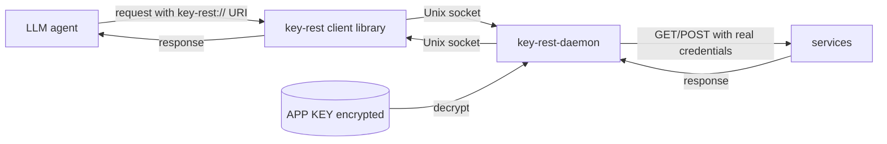
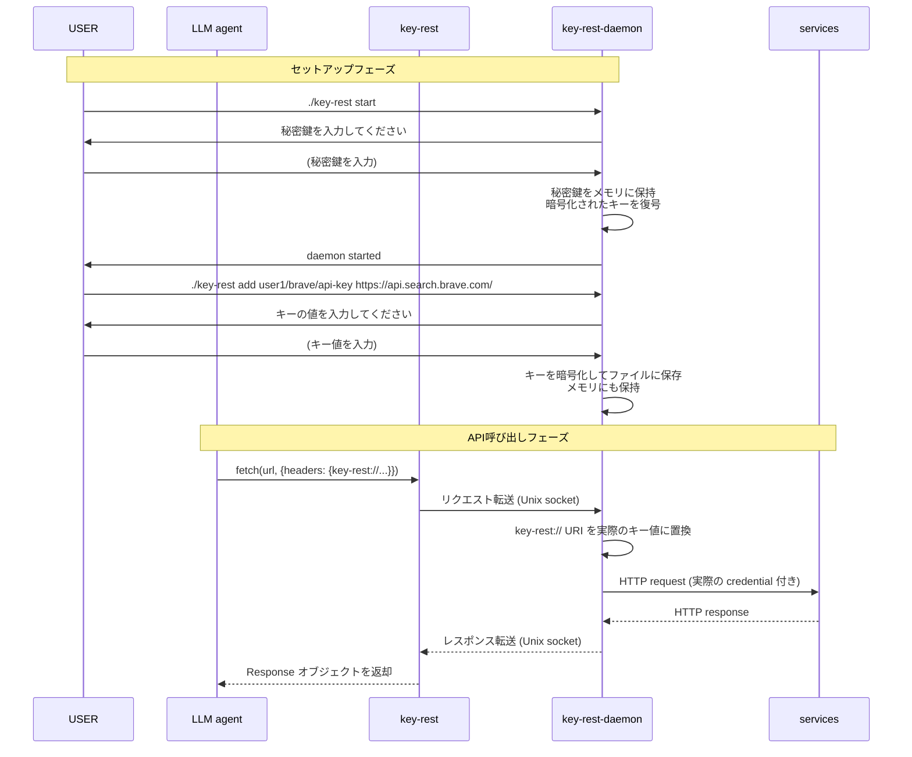
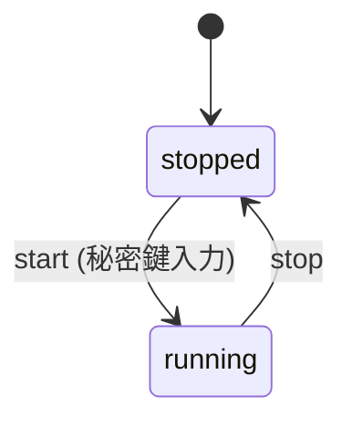

[English](README.md) | [Japanese](README-ja.md)

# 注意

このアプリケーションはまだ十分にテストできていません。

# key-rest


agent に APP key などを見せずに、REST API に App key などの credential を埋め込んで呼び出すためのプロキシです。

例えば、`sk-ant-api03-abcdefg` という API key を使って LLM に REST API を呼び出させたいとします。通常は LLM に API key を直接見せる必要がありますが、key-rest を使うと、 `sk-ant-api03-abcdefg` の代わりに `key-rest://user1/claude/api-key` という文字列をLLMに入れてもらって、例えば Node.js なら fetch の代わりに
```javascript
import { createFetch } from 'key-rest';
const fetch = createFetch();
```
を使ってもらいます。すると、key-rest が `key-rest://user1/claude/api-key` を `sk-ant-api03-abcdefg` に置換して REST API を呼び出して、通常のようにレスポンスを返すことができます。

キー自体は、key-rest コマンドを使って key-rest-daemon に登録します。key-rest-daemon はキーを暗号化してファイルに保存し、リクエストが来たときに復号して使用します。キーは、key-rest-daemon を起動するときのマスターキーで暗号化されます。

# セキュリティ
## API キー
- API キーが平文で保存される領域は下記の通りです。
  - key-rest add 実行時:
    - 標準入力から入力され、メモリに保持されます。
    - マスターキーにて暗号化され、ファイルに保存されます。
  - key-rest-daemon 起動時:
    - ファイルに保存されている暗号化された API キーが復号され、メモリに保持されます。
    - https のために暗号化されます。
## マスターキー
- マスターキーが平文で保存される領域は下記の通りです。
  - マスターキーは key-rest-daemon の起動時に標準入力から入力され、メモリに保持されます。
  - key-rest-daemon 終了時にメモリから消去されます。

## レスポンスマスキング

key-rest-daemon は、認証データをエコーバックする API を通じたクレデンシャル漏洩を防ぐため、レスポンス内のクレデンシャル値をマスクします。

- **生のクレデンシャル**: レスポンスボディやヘッダーに生のクレデンシャル値が含まれる場合、対応する `key-rest://` URI に置換されます。
- **変換出力**: `{{ base64(...) }}` などの変換式はリクエスト送信前に展開されます。upstream が変換後の値（例: base64 エンコードされたクレデンシャル）をエコーバックした場合、レスポンス内で元のテンプレート文字列に置換されます。
- **JSON エスケープされたクレデンシャル**: 特殊文字（`"`、`\` など）を含むクレデンシャルは、JSON エスケープ形式でもマスクされます。

この結果、echo/debug エンドポイントからのレスポンスでは、テンプレートが展開されなかったように見えることがあります（例: レスポンスボディに `{{ base64(...) }}` が表示される）。しかし実際には、upstream サーバーは正しく展開された値を受信しています。

# ブロック図



# シーケンス図



# key-rest-daemon
key-rest-daemon は REST API を呼び出すためのデーモンです。APP KEY を保持し、key-rest からのリクエストを受け取って REST API を呼び出します。

## key-rest-daemon 制御用 commands
- `./key-rest start` : key-rest-daemon を起動します。
  - 起動時に秘密鍵を入力するように求められます。入力された秘密鍵はメモリに保存されます。ファイルには保存されません。
- `./key-rest status` : key-rest-daemon の状態を確認します。
- `./key-rest stop` : key-rest-daemon を停止します。
- `./key-rest add [options] <key-uri> <url-prefix>` : key-rest-daemon にキーを追加します。key は key-uri で指定され、対応する URL プレフィックスは url-prefix で指定されます。
  - key-rest-daemon が running 状態でないときは、秘密鍵を入力するように求められます。
  - key-rest-daemon が running 状態のときは、秘密鍵は入力する必要はありません。
  - そのあとに、キーの値を入力するように求められます。入力されたキーは暗号化されてファイルに保存されます。
  - オプション:
    - `--allow-url` : URL 内での置換を許可します (クエリパラメータ認証用: Gemini, Trello 等)
    - `--allow-body` : リクエストボディ内での置換を許可します (ボディ認証用: Tavily 等)
    - デフォルトでは headers 内のみ置換が許可されます
- `./key-rest remove <key>` : key-rest-daemon からキーを削除します。
- `./key-rest list` : key-rest-daemon に登録されているキーの一覧を表示します。
  - 出力例
    ```
    key1: url-prefix1
    key2: url-prefix2
    ```

## key-rest-daemon 状態



| 状態 | 説明 |
|------|------|
| `stopped` | デーモンプロセスが停止している。ソケットは存在しない。 |
| `running` | デーモンプロセスが起動中。秘密鍵がメモリに保持され、暗号化されたキーが復号されている。Unix ソケットでリクエストを待ち受けている。 |

各状態で利用可能なコマンド:

| コマンド | stopped | running |
|----------|---------|---------|
| `start`  | OK | NG (already running) |
| `stop`   | NG (not running) | OK |
| `status` | OK (stopped と表示) | OK (running と表示) |
| `add`    | OK (秘密鍵入力が必要) | OK (秘密鍵入力不要) |
| `remove` | OK | OK |
| `list`   | OK | OK |

### key-rest:// URI の置換ルール

使用例は [examples/](examples/README-ja.md) (2963592) を参照。

#### key-rest URI の形式

`key-rest://<key-uri>`

key-uri のパス区切りは `/`、各セグメントの有効文字は `[a-zA-Z0-9_.-]`。セグメント数に制限はない。

例: `key-rest://user1/service/key-name`, `key-rest://team/project/group/key`

#### Unenclosed (囲みなし) と Enclosed (囲みあり)

1Password CLI の secret reference syntax を参考に、2つの記法をサポートする。

**Unenclosed:** `key-rest://user1/service/key-name`
- URI の終端は `[a-zA-Z0-9/_.-]` 以外の文字、または文字列末尾
- ヘッダー値やクエリパラメータなど、URI の後に `/` が続かない場面で使用可能

**Enclosed:** `{{ key-rest://user1/service/key-name }}`
- 二重波括弧 `{{ }}` で URI の境界を明示する
- URI の直後に `/` やその他の有効文字が続く場面で必要
- 変換関数を適用できる: `{{ 変換関数(引数, ...) }}`

```
# Unenclosed: URI の後が = や行末なので曖昧さなし
Authorization: Bearer key-rest://user1/openai/api-key

# Enclosed: URI の後に /sendMessage が続くので囲みが必要
https://api.telegram.org/bot{{ key-rest://user1/telegram/bot-token }}/sendMessage

# Enclosed + 変換関数: base64 エンコードが必要な場合
Authorization: Basic {{ base64(key-rest://user1/atlassian/email, ":", key-rest://user1/atlassian/token) }}
```

#### 変換関数

| 関数 | 説明 | 例 |
|------|------|-----|
| `base64(...)` | 引数を連結して base64 エンコードする | `{{ base64(key-rest://user1/email, ":", key-rest://user1/token) }}` |

- 引数はカンマ区切り
- 文字列リテラルはダブルクォートで囲む (例: `":"`)
- key-rest:// URI は置換後の値が使われる
- 将来的に他の変換関数を追加可能

#### 注入先のパターン分類

| パターン | 注入先 | 例 | 記法 |
|----------|--------|-----|------|
| URL クエリパラメータ | url | `?key=key-rest://user1/gemini/api-key` | unenclosed |
| カスタムヘッダー値 | headers | `X-Subscription-Token: key-rest://...` | unenclosed |
| Authorization ヘッダー | headers | `Authorization: Bearer key-rest://...` | unenclosed |
| Authorization Basic | headers | `Basic {{ base64(key-rest://..., ":", key-rest://...) }}` | enclosed + 変換 |
| URL パス埋め込み | url | `https://.../bot{{ key-rest://... }}/method` | enclosed |
| リクエストボディ | body | `{"api_key": "key-rest://..."}` | unenclosed |

#### 置換手順

1. リクエストの全フィールド (url, headers の各値, body) に対して以下の2パターンを検索する:
   - Enclosed: `\{\{.*?\}\}` → `{{ }}` 内を解析し、変換関数があれば関数と引数を抽出、なければ key-uri を抽出
   - Unenclosed: `key-rest://[a-zA-Z0-9/_.-]+` → そのまま key-uri を抽出
   - Enclosed を先に処理し、置換済みの箇所を Unenclosed の対象から除外する
2. 各マッチに含まれる key-rest:// URI について:
   a. key-uri が登録されていることを確認する
   b. リクエスト先 URL が key-uri に紐づいた `url_prefix` と前方一致することを確認する (セキュリティ制約)
   c. マッチが含まれるフィールドがそのキーで許可されていることを確認する (フィールド制限)
      - headers: 常に許可
      - url: `allow_url` が true の場合のみ許可
      - body: `allow_body` が true の場合のみ許可
3. key-rest:// URI を実際のキー値に置換する
4. 変換関数がある場合は適用する (例: `base64(...)` → 引数を連結して base64 エンコード)
5. マッチ箇所全体 (Enclosed の場合は `{{ }}` を含む) を最終結果で置換する

# key-rest
key-rest は LLM agent からの key-uri 付きの REST API 呼び出しを受け取り、key-rest-daemon にリクエストを転送し、key-rest-daemon からのレスポンスを LLM agent に返します。

key-rest は様々なインターフェースがあります。

## Node.js
### key-rest-fetch
fetch 互換のインターフェースです。fetch と同様の引数を受け取り、リクエストを key-rest-daemon に転送します。レスポンスも fetch の Response 互換の形式で返します。

```javascript
import { createFetch } from 'key-rest';

// key-rest-daemon に接続する fetch 関数を作成
const fetch = createFetch();  // デフォルト: ~/.key-rest/key-rest.sock

// 通常の fetch と同じ API で使用可能
const response = await fetch('https://api.example.com/data', {
  method: 'GET',
  headers: {
    'Authorization': 'Bearer key-rest://user1/example/api-key',
    'Content-Type': 'application/json'
  }
});
const data = await response.json();
```

### key-rest-ws
WebSocket 互換のインターフェースです。WebSocket と同様の引数を受け取り、キーを注入して WebSocket 接続を確立します。

```javascript
import { createWebSocket } from 'key-rest';

const WebSocket = createWebSocket();

const ws = new WebSocket('wss://api.example.com/ws', {
  headers: {
    'Authorization': 'Bearer key-rest://user1/example/api-key'
  }
});

ws.on('message', (data) => {
  console.log(data);
});
```

WebSocket の場合、key-rest-daemon が WebSocket 接続を維持し、クライアントとの間でメッセージを中継します。

## Go
### key-rest-http
net/http 互換のインターフェースです。http.Client と同様の API を提供し、リクエストを key-rest-daemon に転送します。レスポンスも `*http.Response` 互換の形式で返します。

```go
package main

import (
    "fmt"
    keyrest "github.com/koteitan/key-rest/go"
)

func main() {
    client := keyrest.NewClient()  // デフォルト: ~/.key-rest/key-rest.sock

    req, _ := keyrest.NewRequest("GET", "https://api.example.com/data", nil)
    req.Header.Set("Authorization", "Bearer key-rest://user1/example/api-key")

    resp, err := client.Do(req)
    if err != nil {
        panic(err)
    }
    defer resp.Body.Close()

    fmt.Println(resp.StatusCode)
}
```

## Python
### key-rest-requests
requests 互換のインターフェースです。

```python
from key_rest import requests

response = requests.get(
    'https://api.example.com/data',
    headers={
        'Authorization': 'Bearer key-rest://user1/example/api-key',
        'Content-Type': 'application/json'
    }
)
data = response.json()
```

### key-rest-httpx
httpx 互換のインターフェースです。async/await に対応しています。

```python
from key_rest import httpx

async with httpx.AsyncClient() as client:
    response = await client.get(
        'https://api.example.com/data',
        headers={
            'Authorization': 'Bearer key-rest://user1/example/api-key',
        }
    )
    data = response.json()
```

## curl
### key-rest-curl
curl のラッパーコマンドです。curl と同じ引数を受け取り、key-rest:// URI を解決して実行します。

```bash
./clients/curl/key-rest-curl https://api.example.com/data \
  -H "Authorization: Bearer key-rest://user1/example/api-key"
```

# 必要要件

- Linux (WSL2 で動作確認済み)
- Go 1.24+
- `socat` (curl ラッパークライアント用)

```bash
# Go (https://go.dev/doc/install)
wget https://go.dev/dl/go1.24.1.linux-amd64.tar.gz
sudo rm -rf /usr/local/go && sudo tar -C /usr/local -xzf go1.24.1.linux-amd64.tar.gz
echo 'export PATH=$PATH:/usr/local/go/bin' >> ~/.bashrc && source ~/.bashrc

# socat
sudo apt install socat
```

# REST API の使用例

[examples/](examples/README-ja.md) を参照してください。

# テスト

## テストに必要なもの

- Node.js 18+ (Node.js クライアントテスト用)
- Python 3.9+ (Python クライアントテスト用)

```bash
sudo apt install nodejs npm python3
cd clients/node && npm install
```

## テストターゲット

```
make test                    # 全テスト実行
├── make test-unit           # ユニットテスト
│   ├── make test-go         #   Go (internal + client)
│   ├── make test-python     #   Python client
│   └── make test-node       #   Node.js client
└── make test-system         # システムテスト (全26サービス end-to-end)
    ├── go                   #   go test 経由
    ├── curl                 #   key-rest-curl 経由
    ├── python               #   key_rest.requests 経由
    └── node                 #   node:net Unix socket 経由
```

| コマンド | 実行内容 |
|---|---|
| `make test` | 以下の全テスト |
| `make test-unit` | `test-go` + `test-python` + `test-node` |
| `make test-go` | `go test ./... -count=1` (system-test/ を除外) |
| `make test-python` | `cd clients/python && python3 -m unittest test_requests -v` |
| `make test-node` | `cd clients/node && npm run build && npm test` |
| `make test-system` | 以下の4つのシステムテスト |
| | `cd system-test/go && go test -v -count=1` |
| | `system-test/curl/system-test.sh` |
| | `python3 system-test/python/system_test.py` |
| | `node system-test/node/system_test.mjs` |

システムテストは [test-server/](test-server/README-ja.md)（全26サービスの認証を模倣するモック HTTPS サーバー）を使用します。詳細は [system-test/](system-test/README-ja.md) を参照してください。

# 開発者向け

## ビルド方法

```bash
git clone https://github.com/koteitan/key-rest.git
cd key-rest
make build
```

プロジェクトルートに `key-rest` バイナリが作成されます。
