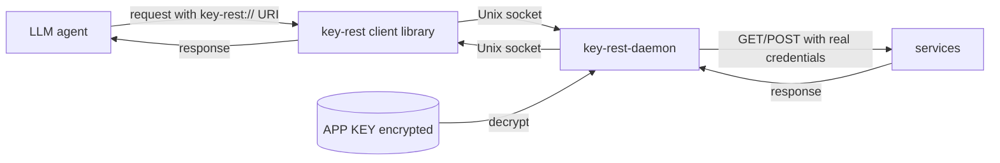
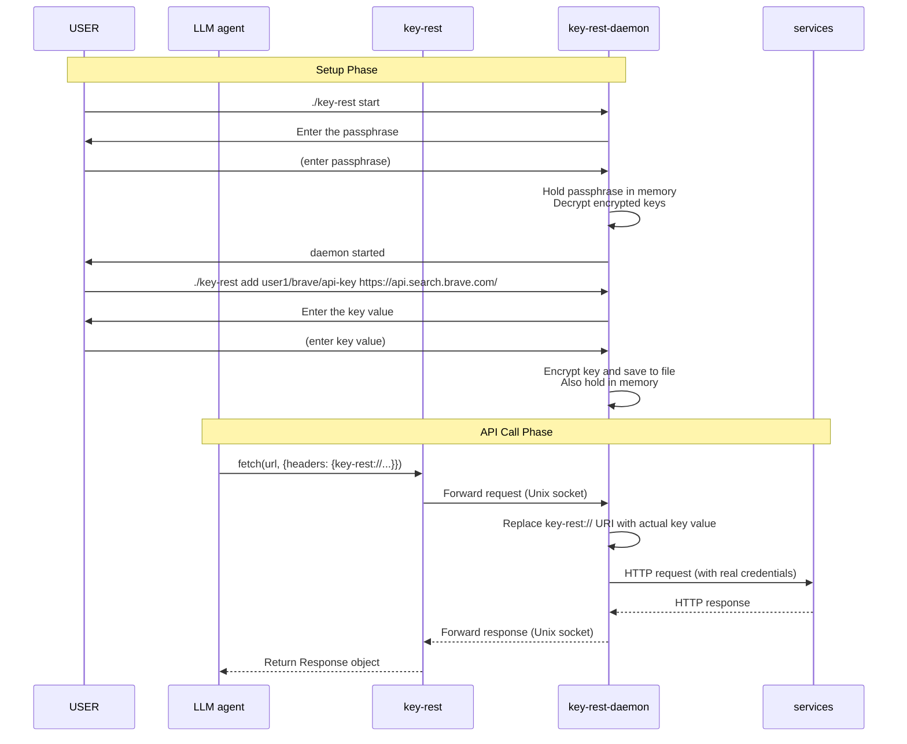
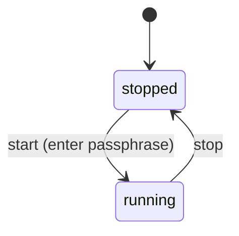

[English](spec.md) | [日本語](spec-ja.md)

# key-rest
A proxy that embeds credentials such as APP keys into REST API calls without exposing them to the agent.

# Block Diagram



# Sequence Diagram



# key-rest-daemon
key-rest-daemon is a daemon for calling REST APIs. It holds APP KEYs and receives requests from key-rest to call REST APIs.

## key-rest-daemon Control Commands
- `./key-rest start` : Starts the key-rest-daemon.
  - At startup, you will be prompted to enter a passphrase. The entered passphrase is stored in memory. It is not saved to a file.
- `./key-rest status` : Checks the status of the key-rest-daemon.
- `./key-rest stop` : Stops the key-rest-daemon.
- `./key-rest add [options] <key-uri> <url-prefix>` : Adds a key to the key-rest-daemon. The key is specified by key-uri, and the corresponding URL prefix is specified by url-prefix.
  - When the key-rest-daemon is not in the running state, you will be prompted to enter the passphrase.
  - When the key-rest-daemon is in the running state, entering the passphrase is not required.
  - After that, you will be prompted to enter the key value. The entered key is encrypted and saved to a file.
  - Options:
    - `--allow-url` : Allows replacement within the URL (for query parameter authentication: Gemini, Trello, etc.)
    - `--allow-body` : Allows replacement within the request body (for body authentication: Tavily, etc.)
    - By default, replacement is only allowed within headers
- `./key-rest remove <key>` : Removes a key from the key-rest-daemon.
- `./key-rest list` : Displays a list of keys registered in the key-rest-daemon.
  - Output example
    ```
    key1: url-prefix1
    key2: url-prefix2
    ```

## key-rest-daemon State



| State | Description |
|-------|-------------|
| `stopped` | The daemon process is stopped. The socket does not exist. |
| `running` | The daemon process is running. The passphrase is held in memory, and the encrypted keys are decrypted. Listening for requests on the Unix socket. |

Commands available in each state:

| Command | stopped | running |
|---------|---------|---------|
| `start`  | OK | NG (already running) |
| `stop`   | NG (not running) | OK |
| `status` | OK (displays stopped) | OK (displays running) |
| `add`    | OK (passphrase required) | OK (passphrase not required) |
| `remove` | OK | OK |
| `list`   | OK | OK |

## Data Storage

- Data directory: `~/.key-rest/`
- Encrypted key file: `~/.key-rest/keys.enc`
- Unix socket: `~/.key-rest/key-rest.sock`
- PID file: `~/.key-rest/key-rest.pid`

### keys.enc Format

Keys are encrypted with the passphrase and saved in the following format:

```json
{
  "keys": [
    {
      "uri": "user1/brave/api-key",
      "url_prefix": "https://api.search.brave.com/",
      "allow_url": false,
      "allow_body": false,
      "encrypted_value": "<encrypted key value (base64)>"
    }
  ]
}
```

Encryption method: AES-256-GCM (using a key derived from the passphrase via PBKDF2)

## Socket Communication Protocol

The key-rest client library and key-rest-daemon communicate via a Unix domain socket (`~/.key-rest/key-rest.sock`). Messages are newline-delimited JSON.

### Request Format

```json
{
  "type": "http",
  "method": "GET",
  "url": "https://api.example.com/data",
  "headers": {
    "Authorization": "Bearer key-rest://user1/example/api-key",
    "Content-Type": "application/json"
  },
  "body": null
}
```

### Response Format (Success)

```json
{
  "status": 200,
  "statusText": "OK",
  "headers": {
    "Content-Type": "application/json"
  },
  "body": "{\"results\": [...]}"
}
```

### Response Format (Error)

```json
{
  "error": {
    "code": "KEY_NOT_FOUND",
    "message": "Key 'user1/example/api-key' not found"
  }
}
```

Error Codes:

| code | Description |
|------|-------------|
| `KEY_NOT_FOUND` | The specified key-rest:// URI is not registered |
| `URL_PREFIX_MISMATCH` | The request URL does not match the key's url_prefix |
| `HTTP_ERROR` | The HTTP request to the external service failed |

### key-rest:// URI Replacement Rules

See [examples/](examples/README.md) (2963592) for usage examples.

#### key-rest URI Format

`key-rest://<key-uri>`

The path separator for key-uri is `/`, and valid characters for each segment are `[a-zA-Z0-9_.-]`. There is no limit on the number of segments.

Example: `key-rest://user1/service/key-name`, `key-rest://team/project/group/key`

#### Unenclosed and Enclosed

Inspired by 1Password CLI's secret reference syntax, two notations are supported.

**Unenclosed:** `key-rest://user1/service/key-name`
- The end of the URI is determined by a character not in `[a-zA-Z0-9/_.-]`, or the end of the string
- Can be used in contexts where the URI is not followed by `/`, such as header values or query parameters

**Enclosed:** `{{ key-rest://user1/service/key-name }}`
- Double curly braces `{{ }}` explicitly delimit the URI boundaries
- Required in contexts where the URI is immediately followed by `/` or other valid characters
- Transform functions can be applied: `{{ transform_function(args, ...) }}`

```
# Unenclosed: No ambiguity since the URI is followed by = or end of line
Authorization: Bearer key-rest://user1/openai/api-key

# Enclosed: Enclosure needed since /sendMessage follows the URI
https://api.telegram.org/bot{{ key-rest://user1/telegram/bot-token }}/sendMessage

# Enclosed + transform function: When base64 encoding is needed
Authorization: Basic {{ base64(key-rest://user1/atlassian/email, ":", key-rest://user1/atlassian/token) }}
```

#### Transform Functions

| Function | Description | Example |
|----------|-------------|---------|
| `base64(...)` | Concatenates arguments and base64 encodes them | `{{ base64(key-rest://user1/email, ":", key-rest://user1/token) }}` |

- Arguments are comma-separated
- String literals are enclosed in double quotes (e.g., `":"`)
- key-rest:// URIs use the replaced values
- Additional transform functions can be added in the future

#### Injection Target Pattern Classification

| Pattern | Injection target | Example | Notation |
|---------|------------------|---------|----------|
| URL query parameter | url | `?key=key-rest://user1/gemini/api-key` | unenclosed |
| Custom header value | headers | `X-Subscription-Token: key-rest://...` | unenclosed |
| Authorization header | headers | `Authorization: Bearer key-rest://...` | unenclosed |
| Authorization Basic | headers | `Basic {{ base64(key-rest://..., ":", key-rest://...) }}` | enclosed + transform |
| URL path embedding | url | `https://.../bot{{ key-rest://... }}/method` | enclosed |
| Request body | body | `{"api_key": "key-rest://..."}` | unenclosed |

#### Replacement Procedure

1. For all fields in the request (url, each header value, body), search for the following 2 patterns:
   - Enclosed: `\{\{.*?\}\}` → Parse the content within `{{ }}`, extract the function and arguments if a transform function exists, otherwise extract the key-uri
   - Unenclosed: `key-rest://[a-zA-Z0-9/_.-]+` → Extract the key-uri as-is
   - Process Enclosed first, and exclude already-replaced positions from Unenclosed targets
2. For each key-rest:// URI found in a match:
   a. Verify that the key-uri is registered
   b. Verify that the request URL prefix-matches the `url_prefix` associated with the key-uri (security constraint)
   c. Verify that the field containing the match is allowed for that key (field restriction)
      - headers: Always allowed
      - url: Allowed only when `allow_url` is true
      - body: Allowed only when `allow_body` is true
3. Replace the key-rest:// URI with the actual key value
4. If a transform function exists, apply it (e.g., `base64(...)` → concatenate arguments and base64 encode)
5. Replace the entire match (including `{{ }}` for Enclosed) with the final result

# key-rest
key-rest receives REST API calls with key-rest URIs from the LLM agent, forwards requests to the key-rest-daemon, and returns responses from the key-rest-daemon to the LLM agent.

key-rest has various interfaces.

## Node.js
### key-rest-fetch
A fetch-compatible interface. It accepts the same arguments as fetch and forwards requests to the key-rest-daemon. Responses are also returned in a fetch Response-compatible format.

```javascript
import { createFetch } from 'key-rest';

// Create a fetch function that connects to key-rest-daemon
const fetch = createFetch();  // Default: ~/.key-rest/key-rest.sock

// Can be used with the same API as regular fetch
const response = await fetch('https://api.example.com/data', {
  method: 'GET',
  headers: {
    'Authorization': 'Bearer key-rest://user1/example/api-key',
    'Content-Type': 'application/json'
  }
});
const data = await response.json();
```

### key-rest-ws
A WebSocket-compatible interface. It accepts the same arguments as WebSocket, injects keys, and establishes a WebSocket connection.

```javascript
import { createWebSocket } from 'key-rest';

const WebSocket = createWebSocket();

const ws = new WebSocket('wss://api.example.com/ws', {
  headers: {
    'Authorization': 'Bearer key-rest://user1/example/api-key'
  }
});

ws.on('message', (data) => {
  console.log(data);
});
```

For WebSocket, the key-rest-daemon maintains the WebSocket connection and relays messages between the client.

## Go
### key-rest-http
A net/http-compatible interface. It provides an API similar to http.Client and forwards requests to the key-rest-daemon. Responses are also returned in an `*http.Response`-compatible format.

```go
package main

import (
    "fmt"
    keyrest "github.com/koteitan/key-rest/go"
)

func main() {
    client := keyrest.NewClient()  // Default: ~/.key-rest/key-rest.sock

    req, _ := keyrest.NewRequest("GET", "https://api.example.com/data", nil)
    req.Header.Set("Authorization", "Bearer key-rest://user1/example/api-key")

    resp, err := client.Do(req)
    if err != nil {
        panic(err)
    }
    defer resp.Body.Close()

    fmt.Println(resp.StatusCode)
}
```

## Python
### key-rest-requests
A requests-compatible interface.

```python
from key_rest import requests

response = requests.get(
    'https://api.example.com/data',
    headers={
        'Authorization': 'Bearer key-rest://user1/example/api-key',
        'Content-Type': 'application/json'
    }
)
data = response.json()
```

### key-rest-httpx
An httpx-compatible interface. Supports async/await.

```python
from key_rest import httpx

async with httpx.AsyncClient() as client:
    response = await client.get(
        'https://api.example.com/data',
        headers={
            'Authorization': 'Bearer key-rest://user1/example/api-key',
        }
    )
    data = response.json()
```

## curl
### key-rest-curl
A curl wrapper command. It accepts the same arguments as curl, resolves key-rest:// URIs, and executes the request.

```bash
./key-rest curl https://api.example.com/data \
  -H "Authorization: Bearer key-rest://user1/example/api-key"
```

# REST API Usage Examples

See [examples/](examples/README.md).
